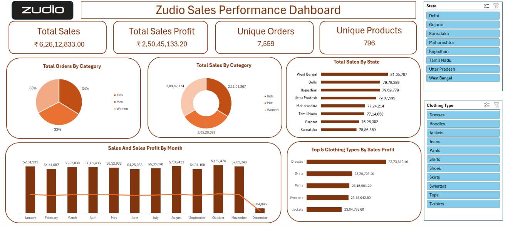

# Zudio Store Sales Performace Dashboard - Excel

An interactive Sales Data Analysis Dashboard built in Microsoft Excel to analyze Zudio’s sales performance across different categories, states, clothing types, and months.

📌 Project Overview

This project analyzes sales and profitability metrics for Zudio across multiple states and apparel categories. The dashboard delivers high-level KPI tracking alongside granular filtering by state and clothing type to uncover regional performance drivers and high-margin product segments.

🛠 Tools & Technologies Used:
- Microsoft Excel 
- Pivot Tables 
- Pivot Charts 
- Slicers 
- Data Analysis 
- Data Visualization 
- Dashboard Design

📈 Key Features

- 🏷️ Analysis of sales and orders by product category
- 🌍 State-wise sales performance comparison
- 👕 Identification of top-performing clothing types by sales profit
- 📅 Monthly analysis of Sales and Sales Profit trends
- 🔎 Interactive State and Clothing Type slicers for dynamic filtering
- 📈 Interactive charts and dashboard visuals for quick business insights

📊 Key Performance Indicators (KPIs)
- Total Sales
- Total Sales Profit
- Unique Orders
- Unique Products

📌 Objective

To transform raw sales data into an interactive dashboard that makes it easier to identify sales trends, profitable products, category performance, and regional performance, supporting data-driven business decisions.

💡 Key Insights

The analysis revealed approximately ₹6.26 Cr in total sales and ₹2.50 Cr in profit, with sales distributed almost equally across Kids, Men, and Women categories. West Bengal emerged as the highest-performing state, while Dresses generated the highest sales profit among clothing types. Monthly sales remained relatively stable throughout most of the year, with October recording the highest sales. A significant decline was observed in December, highlighting a potential data or seasonal trend requiring further investigation.

📸 Dashboard

